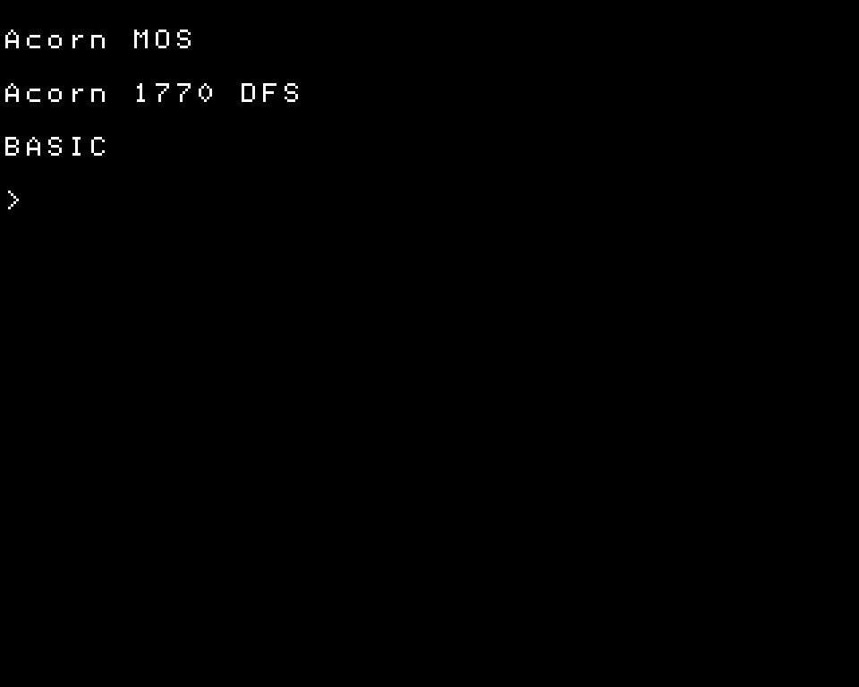
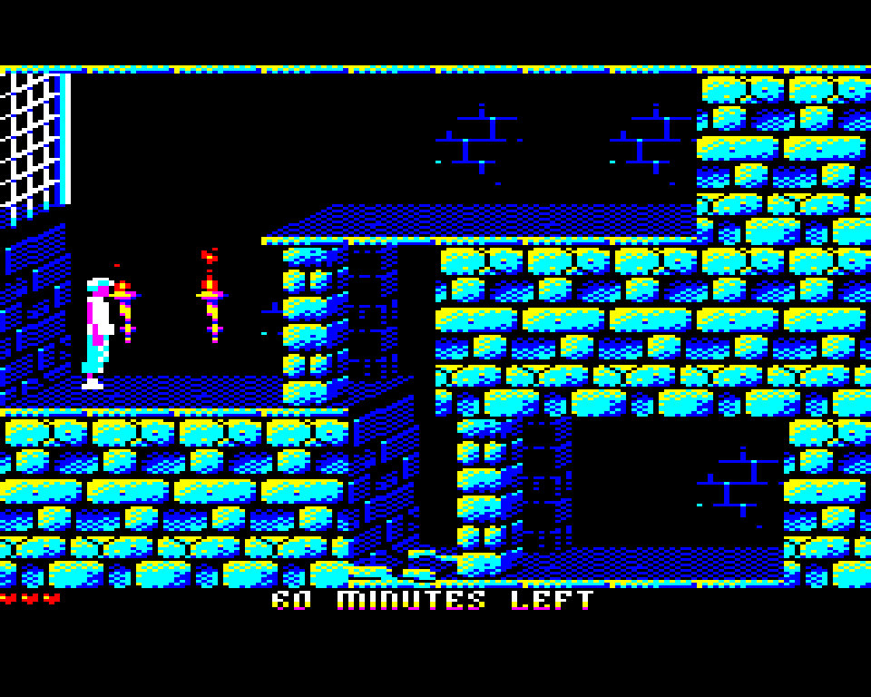
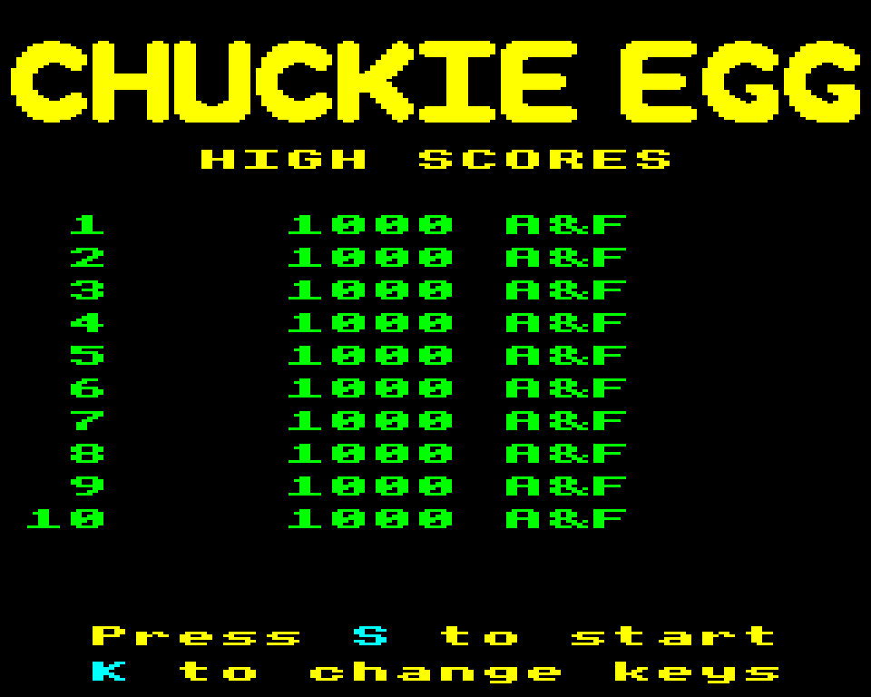
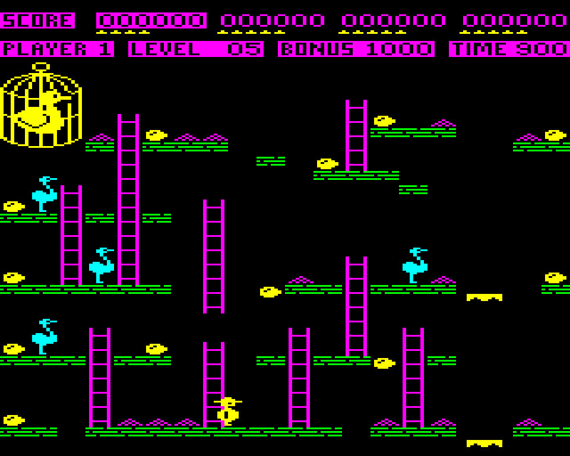

# FRANK MICRO

BBC Microcomputer (Model B / Master 128) emulator for the Raspberry Pi Pico 2 (RP2350). HDMI output with embedded audio. SD card disc browser. PS/2 keyboard, NES/SNES gamepads, optional USB HID (keyboard, gamepad, XInput). Disc image loading (`.SSD`, `.DSD`, `.ADF`, `.ADL`, `.IMG`). Audio over HDMI, I2S, or PWM.

Based on [B-em](https://b-em.bbcmicro.com/) by Tom Walker, with the Raspberry Pi Pico port by [Graham Sanderson](https://github.com/kilograham/b-em). The BBC OS, BASIC, and DFS ROMs are embedded in flash, so no ROM files are required on the SD card.

> **Code heritage:** this project reuses code from the B-em BBC Micro emulator and its Pico fork. B-em provides the full emulation core (6502, 6845 CRTC, Video ULA, System/User VIA, 8271/1770 FDC, SN76489 sound). Graham Sanderson's Pico fork contributes the Thumb-assembly 6502 core, the raw-row rasteriser, the `x_gui` display abstraction, and the sector-streaming disc loader. Platform drivers (HDMI, PS/2, NES pad, I2S/PWM audio, USB HID) are adapted from open-source Pico projects — see the [License](#license) section for full attribution.

## Screenshots

| | |
|---|---|
|  |  |
|  |  |

## Supported platforms

Four RP2350 boards. Each has its own pin layout. All output HDMI video; HDMI-embedded audio is available on the default build.

| Platform | Board | Video | Audio backends | Keyboard |
|----------|-------|-------|----------------|----------|
| m2 | [Murmulator 2.0](https://murmulator.ru) / [FRANK](https://rh1.tech/projects/frank?area=about) | HDMI (PIO) | HDMI, I2S, PWM | PS/2 or USB |
| m1 | Murmulator 1.x | HDMI (PIO) | HDMI, I2S, PWM | PS/2 or USB |
| z0 | [Waveshare RP2350-PiZero](https://www.waveshare.com/rp2350-pizero.htm) | HDMI (PIO) | HDMI, I2S, PWM | PS/2 or USB |
| fj | [Adafruit Fruit Jam](https://www.adafruit.com/product/6200) | DVI (PIO), or DVI (HSTX) | HDMI, I2S | USB only |

Select the platform at build time: `PLATFORM=m1 ./build.sh`. Default is `m2`.

The Fruit Jam differs from the other three in ways that affect how you build and
use it:

- **It needs a USB keyboard, so build it with `USB_HID=1`.** There is no PS/2
  socket and no NES pad connector. Plug the keyboard into either onboard USB-A
  socket.
- **No composite TV.** There is no video DAC on the DVI pins, so
  `HDMI_DRIVER=COMPOSITE` is rejected at configure time.
- **No PWM audio**, so the F12 menu offers two backends rather than three.
  "HDMI" embeds sound in the DVI stream and comes out of the monitor; "I2S" goes
  through the onboard TLV320DAC3100 codec to the headphone jack and the speaker
  connector. On this platform the F12 volume drives the codec's analogue output
  stage rather than scaling the samples.
- **The serial console is on UART1, GPIO 8 and 9**, on the 2x16 header, rather
  than on USB. This is the one platform where a `USB_HID=1` build still has a
  console.
- **It can drive the DVI connector from the RP2350's HSTX peripheral** instead
  of PIO, with `HDMI_DRIVER=HSTX`. That mode is 720x576p50 and shows the whole
  BBC screen: the PIO path drops the bottom 16 scanlines and halves the
  horizontal resolution of MODE 0 and MODE 3, and neither happens here. It
  keeps HDMI-embedded audio and frees the PIO0 block entirely. The trade is
  that it has no USB-CDC console at all, because it retasks the USB PLL to
  clock the video, so use the UART console above. Not yet tested on hardware.

## Features

### Emulation

- BBC Model B (Acorn 1770 DFS) and Master 128. Switchable from the settings menu.
- B-em engine: 6502/65C12 CPU, 6845 CRTC, Video ULA, System and User VIA (6522), Intel 8271 / WD1770 floppy controller, SN76489 sound.
- Optional Thumb-assembly 6502 core for full-speed emulation on the RP2350.
- Disc images: `.SSD`, `.DSD`, `.ADF`, `.ADL`, `.IMG`, streamed sector-by-sector from the SD card.
- SHIFT-BREAK autoboot of a mounted disc.
- Selectable power-on screen MODE (0–7) via the keyboard links.

### Sound

- SN76489 (3 tone channels + noise).
- Three audio backends, switchable **live** from the settings menu (no restart):
  - **HDMI**: audio embedded in the HDMI data-island stream. No extra wiring.
  - **I2S**: external DAC (TDA1387, PCM5102, etc.) — best audio quality.
  - **PWM**: two-pin PWM into an RC low-pass filter. Works without a DAC, but fidelity is limited.
- Adjustable volume and master sound on/off.

### Video

- BBC display MODEs 0–7, including teletext MODE 7.
- Monitor styles: colour, green, amber.
- HDMI (PIO) on all platforms, 640×480p60. HDMI-embedded audio on the default build.
- On the Fruit Jam, optional HSTX video at 720×576p50 (`HDMI_DRIVER=HSTX`),
  which shows all 256 BBC scanlines and keeps all 640 pixels of the 80-column
  modes.

### Storage

- FAT32 SD card over SPI.
- Disc images live under `/micro/disk/` on the card.
- Discs are mounted from the loader overlay (F11) or auto-mounted from the saved settings.
- Settings persisted to `/micro/micro.ini`.

### Input

- PS/2 keyboard (PIO bit-bang driver), mapped to the BBC keyboard matrix.
- NES and SNES gamepads, wired directly. D-pad and buttons map to a configurable key preset.
- USB HID: keyboard and gamepad (including XInput). Optional at build time (`USB_HID=1`). Mutually exclusive with USB CDC stdio.
- Ctrl+Alt+Del triggers a BBC reset.

## Hardware requirements

- Raspberry Pi Pico 2 (RP2350) or a compatible board.
- HDMI connector wired to the TMDS pins through 270 Ω resistors. No encoder IC needed.
- SD card socket (SPI).
- PS/2 keyboard. Recommended.
- NES or SNES gamepad, wired directly. Optional.
- I2S DAC (TDA1387, PCM5102, etc.). Optional: HDMI and PWM audio work without a DAC.

> **PSRAM:** not required. frank-micro keeps the BBC RAM/ROM, video buffers, and emulation state in the RP2350's internal SRAM and runs fine on a stock Pico 2. If PSRAM is present it is detected and initialised, but it is not needed.

> **USB note:** when USB HID is enabled, the native USB port is used for keyboards and gamepads, and USB CDC stdio is disabled. Use UART for console output.

## Pin assignment

| Function       | Signal     | M2  | M1  | Z0  |
|----------------|------------|-----|-----|-----|
| **HDMI**       | CLK−       | 12  | 6   | 32  |
|                | CLK+       | 13  | 7   | 33  |
|                | D0−        | 14  | 8   | 34  |
|                | D0+        | 15  | 9   | 35  |
|                | D1−        | 16  | 10  | 36  |
|                | D1+        | 17  | 11  | 37  |
|                | D2−        | 18  | 12  | 38  |
|                | D2+        | 19  | 13  | 39  |
| **SD card**    | CS         | 5   | 5   | 43  |
|                | SCK        | 6   | 2   | 30  |
|                | MOSI       | 7   | 3   | 31  |
|                | MISO       | 4   | 4   | 40  |
| **PS/2**       | KBD CLK    | 2   | 0   | 2   |
|                | KBD DATA   | 3   | 1   | 3   |
|                | MOUSE CLK  | 0   | —   | —   |
|                | MOUSE DATA | 1   | —   | —   |
| **NES / SNES** | CLK        | 20  | 14  | 4   |
|                | LATCH      | 21  | 15  | 5   |
|                | DATA       | 26  | 16  | 7   |
| **I2S audio**  | DATA       | 9   | 26  | 10  |
|                | BCLK       | 10  | 27  | 11  |
|                | LRCLK      | 11  | 28  | 12  |
| **PWM audio**  | PWM0       | 10  | 26  | 10  |
|                | PWM1       | 11  | 27  | 11  |
| **Tape input** | TAPE IN    | 22  | —   | —   |
| **PSRAM**      | RP2350A    | 8   | 8   | 47  |
|                | RP2350B    | 47  | 47  | 47  |

HDMI pins connect through 270 Ω resistors. PWM and I2S share GPIO 10/11 (M2); the active backend rewires them at runtime. "—" means the function is not available on that platform.

## Usage

### SD card setup

1. Format an SD card as FAT32.
2. Download [`sdcard/micro.zip`](sdcard/micro.zip) and extract it to the root of
   the card. This creates the `micro/` folder with the expected layout:
   `micro/disk/` (disc images), `micro/tape/`, `micro/screenshot/`, and
   `micro/roms/` (optional sideways ROMs).
3. Copy your disc images into `micro/disk/`: `.ssd`, `.dsd`, `.adf`, `.adl`, `.img`. Subdirectories are fine.
4. Insert the card. Power on.

No ROM files are needed to boot — the BBC OS, BASIC, and DFS ROMs are built into
the firmware. The ROMs bundled in `micro.zip` are optional sideways ROMs (ADFS,
View, etc.).

### During use

- **F11**: disc loader overlay.
- **F12**: settings menu.
- **Print Screen**: save a screenshot of the current frame to the SD card.
- **Ctrl+Alt+Del**: reset the BBC.
- **Select + Start** on a gamepad: open the settings menu.

### Settings menu (F12)

| Setting          | Options                                  |
|------------------|------------------------------------------|
| Model            | BBC B, Master 128                        |
| Monitor          | Color, Green, Amber                      |
| Sound            | On, Off                                  |
| Volume           | 0%–100%                                  |
| Audio Out        | HDMI, I2S, PWM                           |
| Limit Speed      | On, Off                                  |
| Startup Mode     | MODE 0–7                                 |
| CAPS/CTRL Keys   | Normal, A/S                              |
| Printer DAC      | On, Off                                  |
| Gamepad          | Off, Arrows, Z X : /                     |

Model changes reboot the board; the other settings apply live.

The settings menu also has a **Take a Screenshot** action that saves the
current frame to the SD card. Screenshots (from **Print Screen** or this menu
action) are written to `/micro/screenshot/` as 8-bit BMP files named
`BBC_0001.BMP`, `BBC_0002.BMP`, and so on. The directory is created
automatically on first use.

## Controller support

### PS/2 keyboard

Full BBC keyboard mapping. Special keys:

| PS/2 key      | BBC key / action |
|---------------|------------------|
| F1 – F10      | BBC f1 – f10     |
| Esc           | ESCAPE           |
| Tab           | TAB              |
| Caps Lock     | CAPS LOCK        |
| F11           | Disc loader      |
| F12           | Settings menu    |
| Print Screen  | Save screenshot  |
| Ctrl+Alt+Del  | Reset            |

### NES / SNES gamepad

| Button         | Action (preset)         |
|----------------|-------------------------|
| D-pad          | UP / DOWN / LEFT / RIGHT (or mapped keys) |
| A              | FIRE / RETURN           |
| B              | SPACE                   |
| Select + Start | Settings menu           |

The gamepad-to-key mapping (Off, cursor Arrows, or the common `Z X : /` game keys) is selectable in the settings menu.

### USB HID gamepad / XInput

Standard USB HID gamepads and XInput controllers (Xbox 360, Xbox One, compatible) work when the firmware is built with `USB_HID=1`.

## Building

### Prerequisites

1. [Raspberry Pi Pico SDK](https://github.com/raspberrypi/pico-sdk) 2.0+.
   ```bash
   export PICO_SDK_PATH=/path/to/pico-sdk
   ```
2. ARM GCC toolchain (`arm-none-eabi-gcc`).
3. Clone the repo and pull the submodule:
   ```bash
   git clone --recurse-submodules https://github.com/rh1tech/frank-micro.git
   cd frank-micro
   ```
   If you already cloned without `--recurse-submodules`:
   ```bash
   git submodule update --init --recursive
   ```
   This fetches [frank-hdmi-sound](https://github.com/rh1tech/frank-hdmi-audio)
   (repo `rh1tech/frank-hdmi-audio`), required for the `HDMI_PIO_AUDIO` video
   driver. The submodule tracks its `frank-micro` branch, pinned to the commit
   recorded in this repo. To pull the latest commit of that branch into the
   submodule:
   ```bash
   git submodule update --remote frank-hdmi-sound
   ```

### Build

```bash
./build.sh                                        # Default: M2, PIO HDMI with embedded audio
PLATFORM=m2 HDMI_DRIVER=HDMI_PIO ./build.sh       # M2, PIO HDMI/VGA (I2S/PWM audio only)
PLATFORM=m2 HDMI_DRIVER=COMPOSITE ./build.sh      # M2, composite PAL/NTSC TV (I2S/PWM audio)
PLATFORM=m1 ./build.sh                            # Murmulator 1.x
PLATFORM=z0 ./build.sh                            # Waveshare RP2350-PiZero
PLATFORM=fj USB_HID=1 ./build.sh                  # Adafruit Fruit Jam (needs USB_HID=1)
PLATFORM=fj USB_HID=1 HDMI_DRIVER=HSTX ./build.sh # Fruit Jam, HSTX video at 720x576p50
USB_HID=1 ./build.sh                              # Enable USB HID input
```

Output: `build/frank-micro.uf2`.

### Build options

All options are environment variables (or CMake cache entries).

| Variable      | Default          | Effect |
|---------------|------------------|--------|
| `PLATFORM`    | `m2`             | `m1` / `m2` / `z0` / `fj` |
| `HDMI_DRIVER` | `HDMI_PIO_AUDIO` | `HDMI_PIO_AUDIO` (HDMI-embedded audio) / `HDMI_PIO` (PIO HDMI **or** VGA, auto-detected from the ribbon; I2S/PWM audio) / `COMPOSITE` (software PAL/NTSC composite TV on `TV_PIN`; I2S/PWM audio; forces 378 MHz, not on `z0` or `fj`) / `HSTX` (RP2350 HSTX DVI at 720×576p50 with HDMI-embedded audio; `fj` only; no USB-CDC console) |
| `CPU_SPEED`   | `252`            | Core clock in MHz |
| `USB_HID`     | `0`              | `1` enables USB HID host (keyboard, gamepad, XInput). Disables USB CDC stdio, except on `fj`, whose console is on UART1. Required on `fj`, which has no other input. |

### Release build

`release.sh` builds every supported (platform × HDMI driver) combination at once:

```bash
./release.sh            # prompts for a version number
./release.sh 1.00       # version 1.00
```

Output goes to `release/`, one UF2 per combination.

### Flashing

With the board in BOOTSEL mode:

```bash
./flash.sh
# or
picotool load build/frank-micro.uf2
```

## License

Copyright © 2026 Mikhail Matveev &lt;xtreme@rh1.tech&gt;

The frank-micro port, drivers, and platform layer are licensed under the [GNU General Public License v3.0](LICENSE).

The emulator core keeps its original license:

| Component | Author | License | Where |
|-----------|--------|---------|-------|
| B-em (BBC Micro emulation engine) | Tom Walker | GPL-2.0 | `src/bem/` |
| B-em Pico port (Thumb 6502, rasteriser, x_gui, sector_read) | Graham Sanderson | GPL-2.0 | `src/bem/pico/`, `src/bem/thumb_cpu/` |
| reSID-fp (bundled with B-em; SID disabled in this build) | Dag Lem / VICE team | GPL-2.0 | `src/bem/resid-fp/` |

Third-party drivers and libraries:

| Component | Author | License | Where |
|-----------|--------|---------|-------|
| FatFS | ChaN | BSD-style permissive | `drivers/fatfs/` |
| pico_fatfs SD driver | elehobica | BSD-2-Clause | `drivers/sdcard/` |
| NES/SNES pad PIO | shuichitakano / fhoedemakers | MIT | `drivers/nespad/` |
| I2S PIO program | Raspberry Pi (Trading) Ltd. | BSD-3-Clause | `drivers/audio_i2s.pio` |
| TinyUSB + HID host | Ha Thach | MIT | `drivers/usbhid/` |
| Pico-PIO-USB (USB host on PIO pins) | sekigon-gonnoc | MIT | `lib/Pico-PIO-USB/` |
| TLV320DAC3100 codec register sequence | Matt Evans (via adafruit/pico-mac) | MIT | `drivers/tlv320dac3100.c` |
| HSTX DVI/HDMI driver with data-island audio | [pico_shared](https://github.com/PicoPlus-devel/pico_shared) (maintained by [fhoedemakers](https://github.com/fhoedemakers)) | GPL-3.0 | `drivers/hstx/` |
| XInput host | Ryan Wendland | MIT | `drivers/usbhid/xinput_host.*` |
| dlmalloc | Doug Lea | CC0 / public domain | `drivers/dlmalloc.c` |

> **GPLv3 and the HSTX build:** `drivers/hstx/` is vendored from a project whose LICENSE is the plain GPLv3 text with no "or later" notice, so it is taken as GPL-3.0-only. The rest of frank-micro is GPL-3.0-or-later, which combines with it freely, but a binary built with `HDMI_DRIVER=HSTX` is covered by GPLv3 alone rather than "version 3 or later". No other build variant is affected. Upstream names no copyright holder in its LICENSE and carries no per-file notices, so none are reproduced in `drivers/hstx/`.

> **ROMs:** the embedded BBC OS, BASIC, and DFS/MOS ROM images are the copyright of their respective owners (Acorn Computers and successors). They are included for emulation/preservation use only.

## Acknowledgments

Thanks to:

- **Tom Walker** for [B-em](https://b-em.bbcmicro.com/) — the BBC Micro emulation engine that powers this project, and the **stardot** community that maintains it.
- **Graham Sanderson** for the [Raspberry Pi Pico port of B-em](https://github.com/kilograham/b-em) — the Thumb-assembly 6502 core, raw-row rasteriser, and sector-streaming disc loader that make it fit on the RP2350.
- **shuichitakano** and **fhoedemakers** for the NES/SNES PIO gamepad driver.
- **ChaN** for FatFS, **elehobica** for the PIO-SPI SD driver, **mrmltr** for the PS/2 PIO driver.
- **Ha Thach** for TinyUSB, **Ryan Wendland** for the XInput host driver.
- **sekigon-gonnoc** for [Pico-PIO-USB](https://github.com/sekigon-gonnoc/Pico-PIO-USB), which is the only way to attach a keyboard to the Fruit Jam.
- **Matt Evans** for [pico-umac](https://github.com/evansm7/pico-umac) and **Adafruit** for the [Fruit Jam fork](https://github.com/adafruit/pico-mac) of it, whose TLV320DAC3100 bring-up sequence the codec driver is adapted from.
- **[Frank Hoedemakers](https://github.com/fhoedemakers)** and the [pico_shared](https://github.com/PicoPlus-devel/pico_shared) project, whose `pico_hdmi` driver is the basis of the HSTX video path, including the HDMI data-island audio that makes embedded sound work without PIO.
- **Doug Lea** for dlmalloc.
- The **Murmulator** community for hardware designs and testing.
- The **Raspberry Pi Foundation** for the RP2350 and the Pico SDK.

## Author

Mikhail Matveev &lt;xtreme@rh1.tech&gt;

[https://rh1.tech](https://rh1.tech) · [GitHub](https://github.com/rh1tech/frank-micro)
